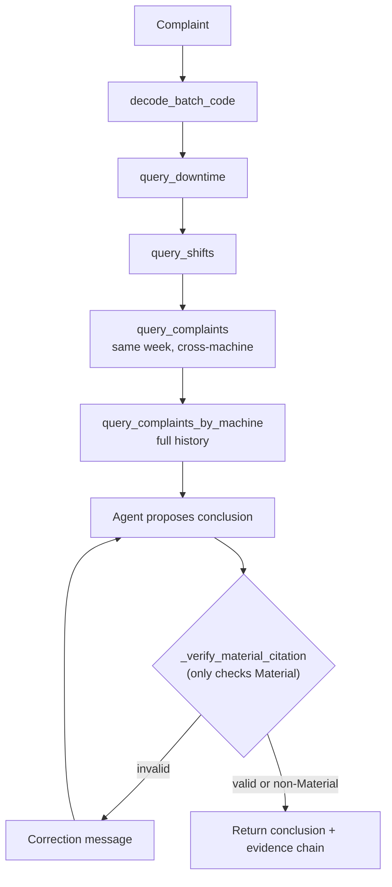
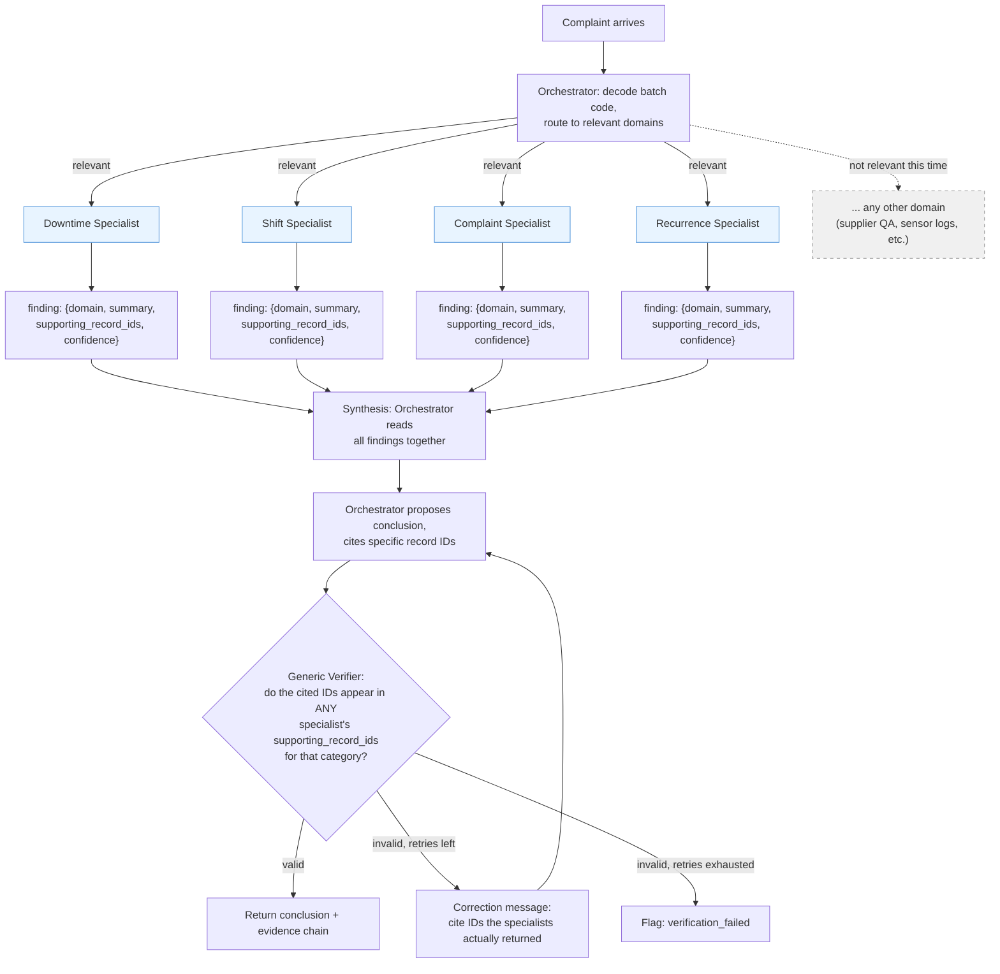

# Scaling architecture: orchestrator + parallel specialists

Not implemented -- this is the design discussion for "what would we build
if there were dozens of data sources instead of 3, and millions of rows
instead of hundreds" (see git history / conversation for the reasoning).
Kept here as forward-looking architecture notes, same purpose as
`data-research-notes.md`, and as the answer to the README's "what I'd do
differently at scale" question.

## Current architecture (what's actually built and running)

One agent, one message thread, tool calls made one at a time, each
waiting for the last to finish before deciding the next:



Two real limits this hits, even at our current tiny scale:
- **C -> D -> E -> F are serial even though none of them depend on each
  other's results.** Downtime doesn't need to know what shifts found.
  That's wasted wall-clock time today, not just a someday problem.
- **H is bespoke to Material.** Adding a 6th, 7th, 8th root-cause category
  means writing a new Python verifier function for each one, by hand,
  forever -- this is the "rules don't scale" problem.

## Proposed architecture: orchestrator dispatching to parallel specialists



The four specialist boxes (S1-S4) run **at the same time**, not one after
another -- none of them need each other's results to do their own job.
`SN` is greyed out to show the routing step's actual point: with dozens of
domains, most of them are irrelevant to any one complaint, and routing
decides that up front instead of calling all of them anyway.

## Why the structured finding contract is the actual fix, not the parallelism

The parallelism is a nice speed win. The thing that actually solves "we
have to hand-write a new rule every time we add a category" is that every
specialist returns the **same shape** of answer:

```json
{
  "domain": "downtime",
  "summary": "Calibration fix D0131 post-dates the batch by ~1 week",
  "supporting_record_ids": ["D0131"],
  "confidence": 0.9
}
```

Today, `_verify_material_citation` has to *parse* the model's citation out
of free-text prose (`root_cause_hypothesis`), which is why it's bespoke to
one category's specific wording patterns. If every specialist hands back
`supporting_record_ids` in a fixed field instead of buried in prose, the
verifier becomes ONE generic function for every category, present and
future:

```
is_valid = any(
    cited_id in finding["supporting_record_ids"]
    for finding in specialist_findings
    if finding["domain"] matches the claimed category
)
```

Add a 6th category -> add one specialist that returns the same shape.
The verifier doesn't change. That's the actual answer to "what happens
when categories increase" -- not smarter prompting, and not a bigger
self-critique loop, but a fixed contract that every new piece plugs into
the same way.

## Serial vs. parallel, concretely

| | Serial (current) | Orchestrator + parallel specialists |
|---|---|---|
| Wall-clock time | Sum of every tool call | ~Max of the slowest specialist |
| Cost | One long growing thread | More total calls, but each is small |
| Adding a domain | Edit the system prompt's step list | Add one specialist, same contract |
| Verification | Bespoke function per category | One generic function, reused |
| Framework | LangGraph, single graph | LangGraph, graph-of-subgraphs (same tool, different shape) |

## Where this project actually stands

18 complaints, 131 downtime records, 1,260 shifts, 3 data sources, 1
category-specific verifier. None of the problems this architecture solves
exist yet at this scale -- building it now would be real added complexity
for zero benefit today. The one piece worth doing regardless of scale:
parallelizing the four *existing* tool calls (downtime/shifts/complaints/
complaints-by-machine), since they already don't depend on each other and
currently run serially for no reason.
