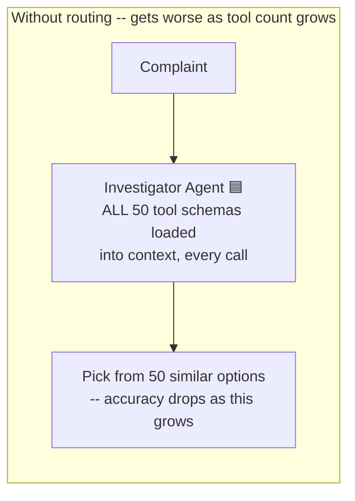
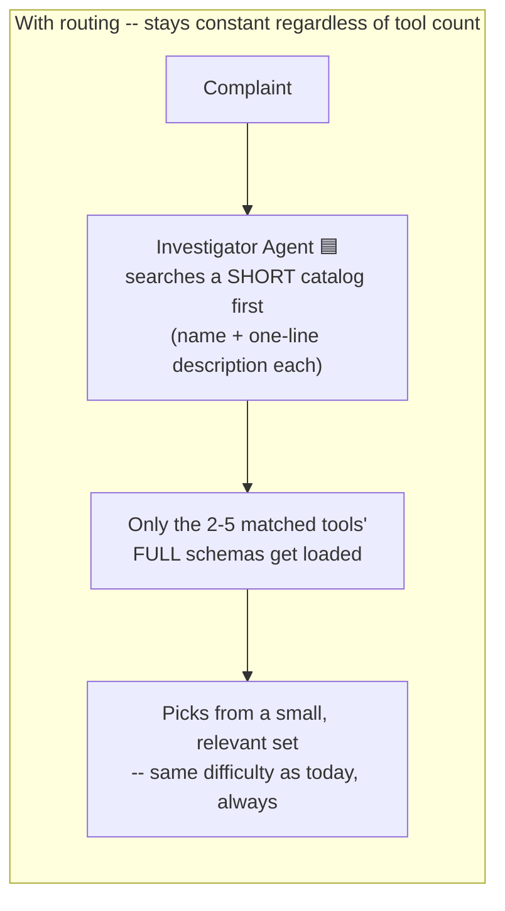
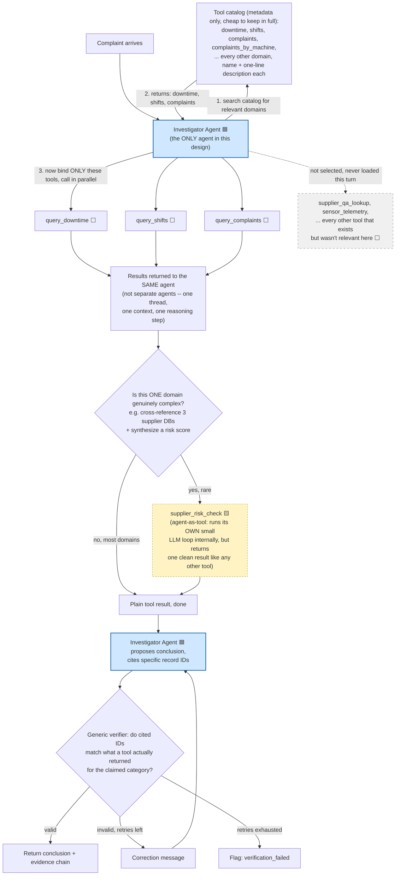
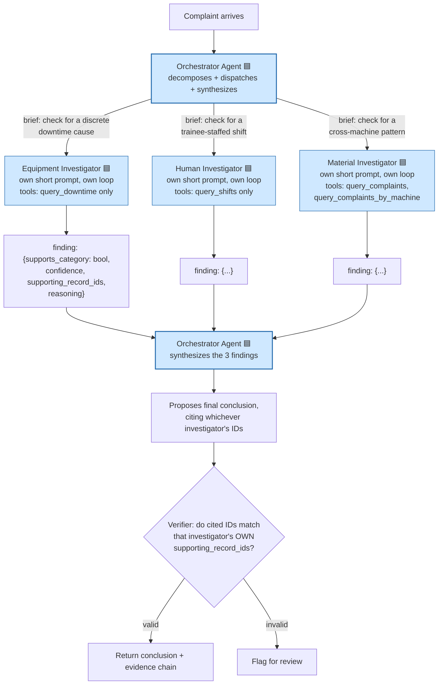

# Scaling architecture: one agent, many tools, routed selection

Not implemented -- design discussion for "what would we build if there
were dozens of data sources instead of 3, and too many tools for one
model call to pick between reliably." Kept here as forward-looking
architecture notes, same purpose as `data-research-notes.md`, and as the
answer to the README's "what I'd do differently at scale" question.

**Correction from the first version of this file:** the earlier diagram
labeled every domain a "Specialist," which reads as "one agent per
domain." That's wrong, and worth being precise about, because it changes
the whole answer to "how many agents do we need":

- **Agent** = something that makes its own LLM call(s) to reason across
  multiple steps before it has an answer.
- **Tool** = a plain function. No LLM inside it. Runs, returns data, done.

For our actual domains -- downtime, shifts, complaints -- there is
nothing to reason about *inside* any one of them. "Look up shift records
for this machine and window" is one query. That's a **tool**, not an
agent. The entire design below has exactly **one agent** in it. Everything
else is a tool the one agent calls.

## Legend used in the diagrams below

| Shape/color | Meaning |
|---|---|
| 🟦 Blue rounded box | **Agent** -- makes LLM calls, does reasoning |
| ⬜ Plain box | **Tool** -- deterministic function, no LLM |
| 🟨 Dashed box | **Agent-as-tool** -- rare; a tool that happens to run its own small agent loop internally, but looks like an ordinary tool to whatever calls it |

## The actual question: what happens when tool count grows?

This is the real problem your question is pointing at, and it's worth
being concrete about *why* it happens, not just that it happens: every
tool's name, description, and parameter schema gets stuffed into the
model's context on every single call, whether that tool is relevant to
the current complaint or not. At 6 tools (what we have today) that's
cheap and the model rarely confuses them. At 50 tools, two things get
worse at once -- more tokens spent describing tools nobody's going to
call, and a harder multiple-choice problem where similar-sounding tools
increasingly get confused for each other or missed entirely. This is a
documented, measurable degradation, not a vague worry.

The mechanism in `B2` isn't hypothetical -- it's the same pattern behind
`ToolSearch` in the environment this very assistant runs in: tools aren't
all loaded up front, they're found by a lightweight search over short
descriptions, and only the matched one's full definition becomes
callable. Same idea, applied to `query_downtime`-style tools instead of
assistant tools.

## Full picture: one agent, a tool catalog, routed selection, parallel calls

Reading this straight: there is **one** blue box (the Investigator Agent)
appearing twice in the flow -- once to decide what to look up, once to
conclude from what came back. It never stops being the same agent, the
same conversation thread. The catalog search, the tool calls, and the
verifier are all plain code and data, not additional agents. The one
dashed yellow box (`supplier_risk_check`) is the *only* place a second
LLM might ever get invoked, and only for a domain complex enough to
justify it -- from the orchestrating agent's point of view, it's
indistinguishable from any other tool: it sends inputs, gets a result
back.

## Which agent uses which tool, mapped onto what actually exists today

| Component | Type | Who owns it |
|---|---|---|
| `agent.py`'s Investigator | Agent 🟦 | -- (this is the one agent) |
| `decode_batch_code` | Tool ⬜ | Called by the Investigator |
| `query_downtime` | Tool ⬜ | Called by the Investigator |
| `query_shifts` | Tool ⬜ | Called by the Investigator |
| `query_complaints` | Tool ⬜ | Called by the Investigator |
| `query_complaints_by_machine` | Tool ⬜ | Called by the Investigator |
| `_verify_material_citation` | Plain code, not a tool | Runs automatically after a conclusion, not chosen by the model at all |

At our current scale there's no catalog/routing step because 6 tools
never needed one -- the Investigator just has all 6 bound directly, which
is exactly the "small set, no confusion" end state the routing step is
built to preserve once the tool count grows past what one call can hold
comfortably.

## Serial vs. parallel, and where routing fits, concretely

| | Today (6 tools) | At scale, no routing | At scale, with routing |
|---|---|---|---|
| Tools loaded per call | 6 | 50+ | 2-5 (whatever's relevant) |
| Tool-pick accuracy | Fine | Degrades | Same as today |
| Number of agents | 1 | 1 | 1 (+ rare agent-as-tool) |
| Tool calls | Serial, one at a time | N/A | Parallel where independent |

## Alternative considered: true multi-agent orchestration (one agent per category)

Everything above keeps exactly one agent. There's a genuinely different
design worth naming, because it directly targets something we actually
hit, not a hypothetical: **the whack-a-mole problem documented in
DAY3_STATUS.md**, where strengthening the prompt's Material-detection
rules broke Equipment-detection, and vice versa, across three rounds of
prompt edits. That happened because all four categories' detection logic
lives in ONE shared system prompt, fought over by one model call.

The alternative: give each category its own agent, with its own short,
non-competing prompt, dispatched by an orchestrator:

This is genuinely 4 agents (orchestrator + 3 category investigators),
each making its own LLM call(s). The reasoning-competition problem
becomes structurally impossible -- there's no shared prompt left to fight
over, so strengthening the Material investigator's prompt literally
cannot touch the Equipment investigator's.

**Real costs**: more LLM calls and latency (mitigated by dispatching the
category investigators in parallel, since they're independent of each
other); a new failure surface at synthesis (the orchestrator now has to
weigh 4 reports instead of reading raw tool data itself); each
investigator needs its own step-cap/retry discipline, not just one.

**Decided against building the 4-separate-agent version for now.** What
we actually shipped -- one agent, narrow mechanical verification of just
the one failure mode the eval isolated -- already fixed the regression
(61.1% -> 72.2%) without the added machinery. The version actually worth
testing, if the single-shared-prompt problem resurfaces as more
categories get added: keep ONE reusable investigator implementation
(same code, same graph-building function) and instantiate it multiple
times, once per category, each with its own narrow prompt/tool subset --
same reasoning-isolation benefit as the diagram above, without hand-
duplicating the agent code four times over. That's the version this
project actually tries next, on a separate branch, kept apart from the
single-shared-prompt version so both can be measured against the same
`eval.py` numbers rather than assumed.

## Where this project actually stands

6 tools, 3 data sources, 1 agent. The catalog/routing step doesn't exist
because nothing here has hit the point where it's needed yet -- adding it
today would be solving a problem this project doesn't have. The
parallel-tool-calls piece is the one part worth doing regardless of
scale, since `query_downtime`/`query_shifts`/`query_complaints`/
`query_complaints_by_machine` already don't depend on each other and
currently run one after another for no reason.
